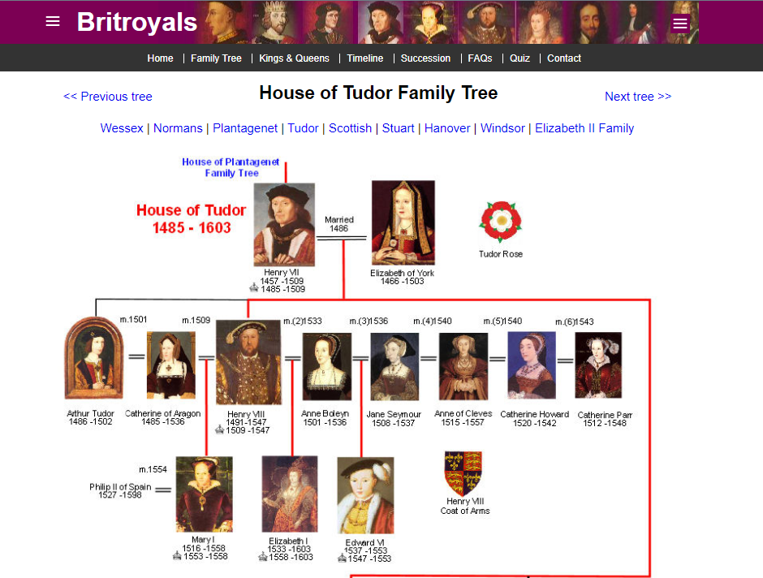

# Welcome to my Project 1 README page

<ul class="navlist">
                <li><a href="#my project 1">My Project 1</a></li>
                <li><a href="#design">Design</a></li>
                <li><a href="#location">Location</a></li>
                <li><a href="#validation">Validation</a></li>
                <li><a href="#tools">Tools</a></li>
                <li><a href="#course">Course</a></li>
                <li><a href="#books">Books</a></li>
                <li><a href="#influences">Influences</a></li>
                <li><a href="#links">Links</a></li>
            </ul>

# [My Project 1](http://project1.dazl.ie)

Hi! My name is Graham. In this README page were you will find out a little about me, my website, my coding journey, my projects and who has influenced me in the development of this website.

I am very new to coding and this will be one of my first real projects, during this project I met many walls I needed to climb. As with any project thinking of an idea of which to base it on, can be one of the hardest parts and this was no exception. As a history buff I decided to base within this field.
# Design.

When thinking of an idea for this project I had many idea's and options, as a history buff I choose the Royal House of Tudor as its covers some of my favourite Monarchs and storylines. For the colors used on this project I kept to colors that either matched the royal crest or complimented it such as <u>Linen</u> and <u>Goldenrod</u>. On font, I used <u>Libre Caslon Text</u> as it had an old look to it. The site layout decided itself as the pages are listed in order of there reign.

 I hope you enjoy.

##  <b>Main page:</b>
I kept this main page clean and to the point. At the top you see the 'The Tudor's' logo to the left and the and the page options(Monarchs) to the right.

The center is dominated by the royal crest of the house of Tudor, the timeframe of this royal dynesty and a brief note of the event that created this royal house.

At the bottom I have two buttons that are links to external sites for more information on the Tudor's, these links will open on an external page.

When viewed on a smaller screen, the crest was too dominant, to fix this issue I changed the crest to look faded and more in the background.

### Family Tree link:

### Battle of Boswort link:

## <b>First Monarch:</b>
Each page contains a photo of the revelent King/Queen, the dates of there reign and a brief description.

Below each picture is a 'Read More' link that will bring you to a second page containing some key facts and dates of events during the reign of that monarch.

## <b>Favicon:</b>
To finish off the design of this website, I added a favicon of the House of Tudor shield.

# Location

All my projects are also available to view on my portfolio website.
[www.dazl.ie](http://project1.dazl.ie)

# Validation
To ensure the functionality of this project I had 3 tasks.
1. HTML Validation
<input type="checkbox" input checked>
2. CSS Validation
<input type="checkbox" input checked>
3. Lighthouse Accessibility
<input type="checkbox" input checked>

The results of these test are shown below:

<ul>
<li>HTML <ul style="list-style-type:circle"><li>No errors returned on W3C HTML validator</li></ul>
</li>
<li>CSS <ul style="list-style-type:circle"><li>No errors returned on W3C CSS validator</li></ul>
</li>
<li>Accessibility <ul style="list-style-type:circle"><li>On website inspection, lighthouse results are shown below</li></ul>
</li>
</ul>

# Tools

The main tools of this project were:

### [W3C HTML](https://www.w3schools.com/html/default.asp)
### [W3C CSS](https://www.w3schools.com/cssref/index.php)

As well as the Code Institute course content, I also got inspiration from some
online tutorials and video's and also books such as  books from Mike McGraths and video tutorials from Mike Dane.

# Course

## Professional Diploma in Full Stack Software Development
### University College Dublin [Website](https://www.ucd.ie/professionalacademy/why-ucd-professional-academy/)

### Code Institute [Website](https://codeinstitute.net/ie/full-stack-software-development-diploma/?utm_term=code%20institute&utm_campaign=CI+-+IRL+-+Search+-+Brand&utm_source=adwords&utm_medium=ppc&hsa_acc=8983321581&hsa_cam=14304747355&hsa_grp=128775288169&hsa_ad=595155717776&hsa_src=g&hsa_tgt=kwd-342001843376&hsa_kw=code%20institute&hsa_mt=p&hsa_net=adwords&hsa_ver=3&gclid=Cj0KCQjwnvOaBhDTARIsAJf8eVOdV0BAxB5DwdTrFB9AvR5tJ73tLtvCsSeHDsSSq9e1gNbiXiNLTZQaAkyKEALw_wcB)
